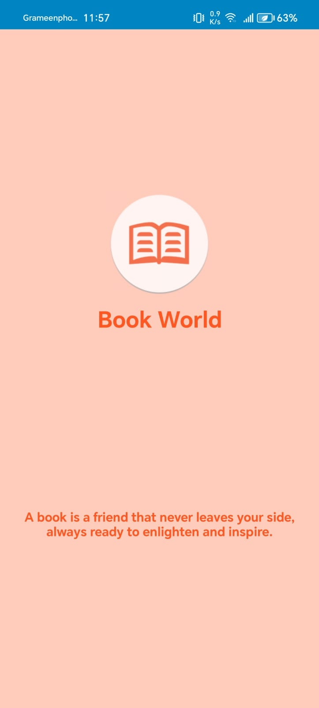
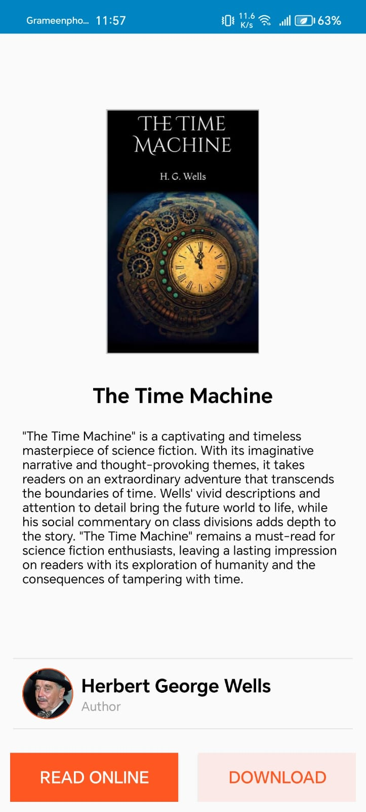
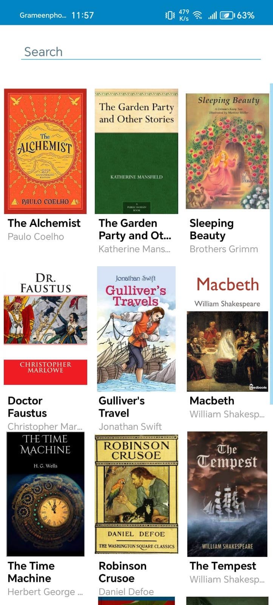

# 📚 Book World

_An app where you can read, organize, and download millions of books — completely free._

---

## 🔍 Overview

**Book World** is a lightweight, user-friendly Android app that gives you access to a vast collection of free books. Whether you're a student, a researcher, or simply a passionate reader, Book World offers a seamless reading experience along with the ability to download and manage your personal library. All for free.

---

## ✨ Features

- ✅ User-friendly interface  
- 📖 Read books for free  
- ⬇️ Download millions of books  
- ⚡ Lightweight and fast  
- 👤 Learn about the author  
- 📄 Read book summaries  
- 🔍 Search millions of titles  
- 📚 Manage your personal library  
- 📘 Built-in book reader  
- 🌍 Access to a vast free collection of books  

---

## 🛡️ Important Notice

⚠️ **Security Notice:**  
Only screenshots and a partial portion of the source code are provided in this repository for demonstration purposes. The full application and source code are protected for security reasons.

If you are interested in accessing the complete app, please contact the developer directly:  
📧 **minhajul.cse.bd@gmail.com**

---

## 📸 Screenshots

|  |  |  |

---

## ⚙️ Tech Stack

- Language: **Java**
- IDE: **Android Studio**
- Platform: **Android**

---

## 📁 Project Structure (Partial)

